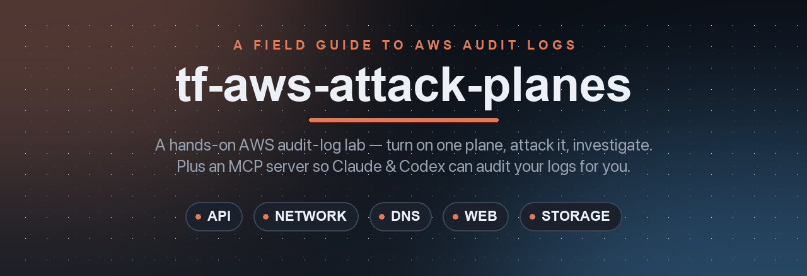
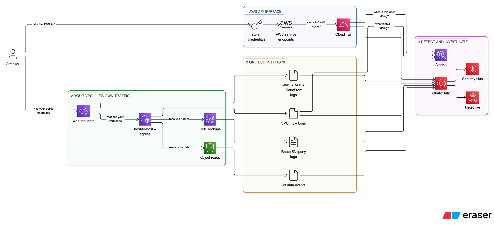
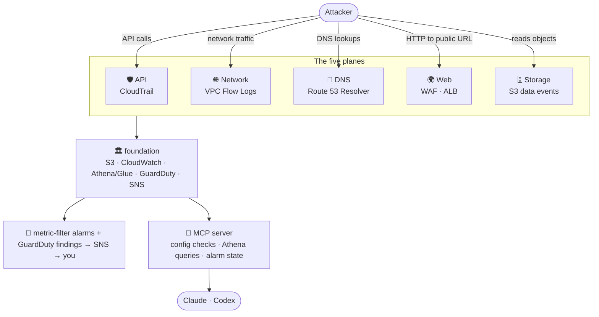
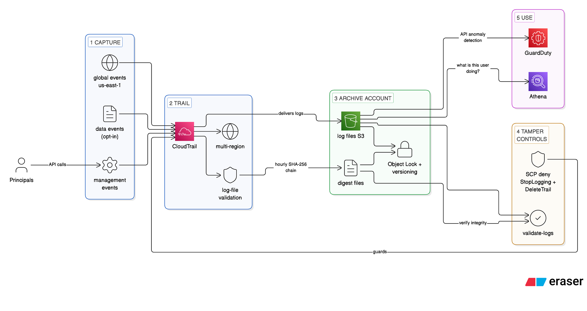
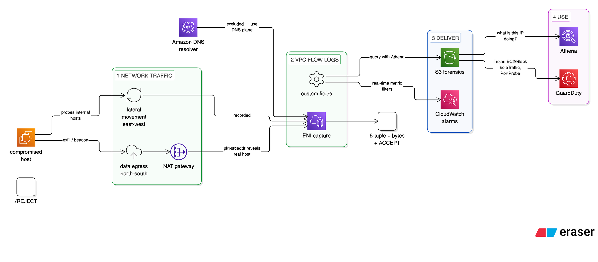
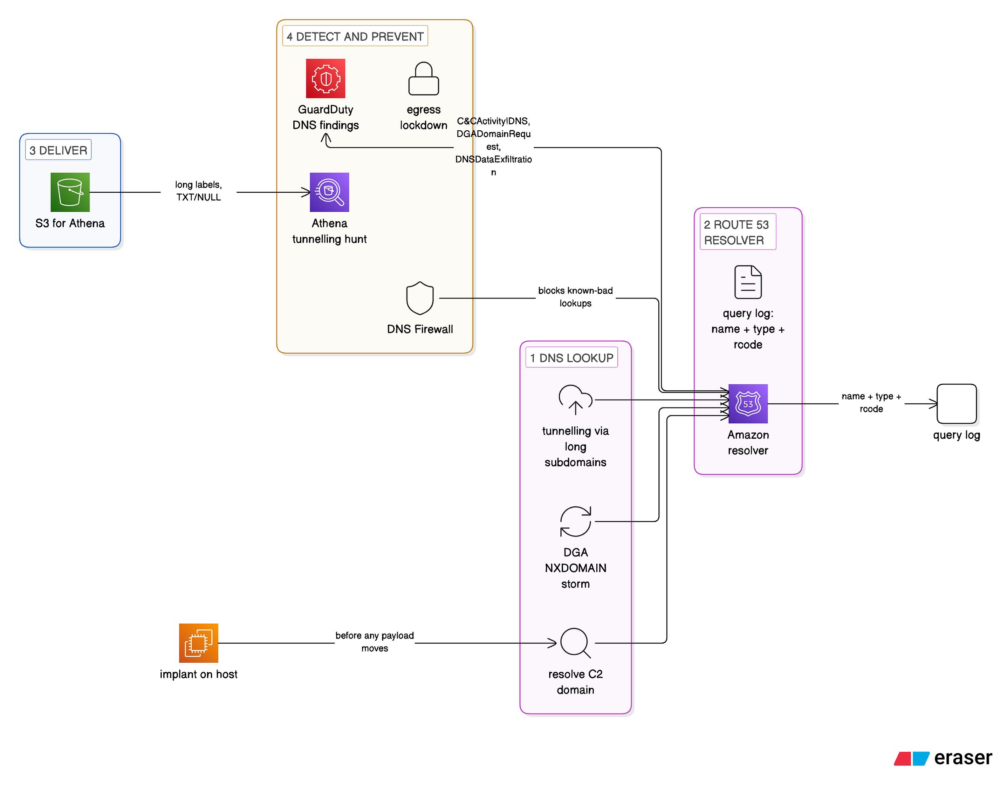
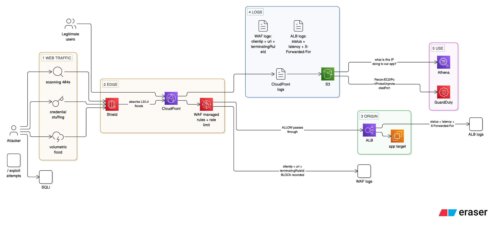
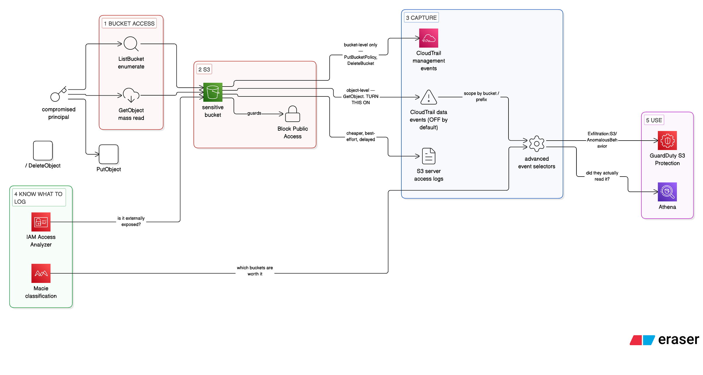

<div align="center">



# 🛡️ tf-aws-attack-planes

> Every attack lives in a different plane. Turn on one plane's logging, fire a *real*
> simulated attack at it, detect it, and investigate what it caught — then point Claude or
> Codex at your own account and let it run the same checks.

[](https://medium.com/@omarnour_5895/what-is-this-user-doing-6e5b5613d147)
[](https://developer.hashicorp.com/terraform)
[](https://registry.terraform.io/providers/hashicorp/aws/latest)

[](mcp-server/)
[](mcp-server/)
[](mcp-server/)
[](LICENSE)
[](https://github.com/omardin14/tf-aws-attack-planes/stargazers)

**[Quick Start](#-quick-start) · [Five Planes](#-the-five-planes) · [Scenarios](#-scenarios) · [MCP Server](#-mcp-server) · [Variables](#-variables) · [Teardown](#-teardown)**

</div>

> [!WARNING]
> This intentionally creates an over-permissive IAM user, leaks its access key, and runs a
> simulated attack (enumeration + privilege escalation + persistence) against **your own
> account**. The attack Lambda also creates a backdoor IAM user out-of-band.
> **Apply this only in a dedicated throwaway sandbox account.** Never in production, never
> in a shared account. A permissions boundary or SCP on the sandbox is a sensible extra guard.

---

## ⚡ Quick Start

Two ways in — stand up the lab and attack it, or point the MCP server at an account you
already run.

### Path A — run the lab

```bash
git clone https://github.com/omardin14/tf-aws-attack-planes.git
cd tf-aws-attack-planes
```

```hcl
# terraform.tfvars
alert_email         = "you@example.com"   # confirm the SNS email AWS sends you
scenario_01_enabled = true                # start with the API-plane account takeover
auto_fire           = true                # fire the attack on apply
enable_guardduty    = false               # Free-Tier-friendly default (see Variables)
```

```bash
terraform init
terraform apply
```

On apply the foundation + scenario stand up, the attack fires, the metric-filter alarms trip,
and SNS emails you. Then open the Athena workgroup (`terraform output athena_console_url`) and
run the saved `s01-*` queries to answer *"what is this user doing?"* Full walkthrough in
[Scenarios](#-scenarios).

### Path B — audit your own account (MCP)

```bash
cd mcp-server && pip install -e .
```

```jsonc
// .mcp.json (or your client's MCP settings)
{ "mcpServers": { "aws-audit-planes": {
    "command": "aws-audit-planes-mcp",
    "env": { "AWS_PROFILE": "sandbox", "AWS_REGION": "eu-west-1" } } } }
```

Then just ask your assistant: *"check my AWS audit-log configuration"* or *"who read the
crown-jewels bucket in the last 6 hours?"* — it calls the tools itself. See
[MCP Server](#-mcp-server).

---

## 🛠️ Task Runner (`make`)

Every command in this README also has a `make` target. The Makefile is a thin wrapper — each
recipe echoes the real `terraform` / `simulate-attack.sh` command before running it, so you can
always drop back to the raw tool. `make help` is the index.

```bash
make preflight     # terraform / aws / python3 / jq + your AWS identity
make tfvars        # bootstrap terraform.tfvars from the example (never overwrites)
make deploy_1      # stand up scenario 1
make scenario_1    # fire its attack
make athena        # open the Athena console for this deployment
make destroy       # tear it down (typed confirmation)
```

| Group | Targets |
|---|---|
| Terraform | `init` `reinit` `plan` `apply` `destroy` `outputs` `athena` `fmt` `validate` `lint` |
| Deploy | `deploy_1` … `deploy_5`, `deploy_all` |
| Fire | `scenario_1` … `scenario_5`, `fire_all` |
| MCP | `mcp` `mcp-test` `mcp-dev` `mcp-run` `mcp-register` |
| Housekeeping | `preflight` `tfvars` `test` `clean` `distclean` |

Variables: `REGION` `PROFILE` `AUTO` `ONLY` `CONFIRM` `N` `I` `ARGS` `OUT` `TF_ARGS`.

```bash
make scenario_2 N=5 I=60          # fire 5 times, 60s apart
make scenario_1 ARGS=--no-reset   # observe the quarantined state
make deploy_3 REGION=eu-west-1
make apply AUTO=1                 # -auto-approve
make outputs OUT=log_bucket       # one raw value
```

**Worth knowing before you run it:**

- **`deploy_N` is additive.** It passes `-var scenario_0N_enabled=true` and leaves the other
  scenarios as `terraform.tfvars` has them — so if your tfvars enables all five, `make deploy_3`
  applies all five. Read the plan before approving. `ONLY=1` deploys that scenario exclusively
  and **destroys the other four**.
- **`apply` and `destroy` prompt by default**; `AUTO=1` adds `-auto-approve`. `destroy` also has
  a typed guard (`CONFIRM=destroy` skips it, for scripted teardown).
- **`destroy` needs an authenticated `aws` CLI**, not just Terraform credentials — scenario 1 has
  a destroy-time provisioner that invokes a cleanup Lambda to remove the out-of-band
  `atkplane-persist-*` IAM users. If it can't run, live leaked credentials are left behind. That's
  what `make preflight` checks.
- **Don't change `REGION` between apply and destroy** — the destroy provisioner reads the region
  from state, not the flag.
- **`-var` precedence**: CLI beats `terraform.tfvars` beats defaults. Variables the Makefile
  doesn't pass (`alert_email`, `enable_guardduty`, `enable_data_events`, …) still come from your
  tfvars — `deploy_5` in particular inherits `enable_data_events`, which bills per event.
- **`clean`/`distclean` never touch `terraform.tfstate*` or `terraform.tfvars`.** State is local
  with no backend; deleting it orphans every AWS resource.
- **`make lint`** treats `fmt -check` and `validate` as hard gates; tflint findings are advisory
  (there's no `.tflint.hcl` yet). `TFLINT_STRICT=1` makes them fatal.
- **`make mcp-dev`** needs node/npx — the MCP Inspector is an npm package.

Requires GNU Make 3.81+ (what macOS ships) — no GNU-only extensions are used.

---

## ✨ What You Get

| | Capability | What it does |
|---|---|---|
| 🏛️ | **Shared foundation** | Multi-region CloudTrail (log-file validation, global events) → **both** S3 (Athena forensics) and CloudWatch Logs (alarms), an S3 log bucket, an Athena workgroup + Glue database, GuardDuty, and an SNS alert topic — reused by every scenario. |
| 🎯 | **Five attack-plane scenarios** | One deliberately-attackable slice per plane: API, network, DNS, web, storage. Each is a real, fireable attack, not a diagram. |
| 🔁 | **trigger → detect → investigate** | Every scenario follows the same loop: fire the attack, catch it with an alarm/hunter, then answer the question with saved queries. |
| 🔎 | **Saved Athena & Logs-Insights queries** | The exact queries from the blog, pre-created as named queries — run them in order and read the story off the result grid. |
| 🚨 | **Detection wiring** | CloudWatch metric-filter alarms, a scheduled DNS hunter Lambda, and an optional GuardDuty → EventBridge → auto-response path. |
| 🔫 | **`simulate-attack.sh`** | Re-fire any scenario's attack on demand, N times, without re-applying — for fuller timelines and screen recordings. |
| 🤖 | **MCP server** | Point Claude/Codex at a live account to check configuration, run the canonical investigations, and read alarm state — read-only. |

---

## 🧭 The Five Planes

<div align="center">
  
</div>

Audit logs are not one thing. *"We have CloudTrail, we're fine"* is the trap — CloudTrail
logs **only AWS API activity**. Every other plane needs its own log.

| Plane | The question it answers | Primary log source | Scenario |
|---|---|---|---|
| **API** | Who called which AWS API, from where? | CloudTrail | [1 — Account Takeover](#1--account-takeover--api-plane--cloudtrail) |
| **Network** | Which IP talked to which IP, on what port? | VPC Flow Logs | [2 — Compromised Workload](#2--compromised-workload--network-plane--vpc-flow-logs) |
| **DNS** | What names are our resources resolving? | Route 53 Resolver query logs | [3 — DNS Exfil](#3--dns-exfil--dns-plane--route-53-resolver-query-logs) |
| **Web** | What is hitting our public endpoints? | WAF · ALB · CloudFront logs | [4 — Web Attack](#4--web-attack--web-plane--waf--alb-access-logs) |
| **Storage** | Who read or wrote which object? | CloudTrail data events · S3 access logs | [5 — S3 Data-Events Exfil](#5--s3-data-events-exfil--storage-plane) |



Above the raw logs sit **GuardDuty** (managed detection over CloudTrail/VPC/DNS),
**Security Hub / Detective** (aggregation and behavioural graphs), and the query layer —
**Athena / CloudTrail Lake / Security Lake** — where *"what is this user doing?"* becomes an
actual SQL statement.

---

## 🏗️ Layout

```
.
├── modules/
│   ├── foundation/                    # shared audit-logging estate, reused by every scenario
│   │   • multi-region CloudTrail (log-file validation, global events)
│   │     delivering to BOTH S3 (forensics/Athena) and CloudWatch Logs (alarms)
│   │   • S3 log bucket · Athena workgroup + Glue database · shared cloudtrail_logs table · GuardDuty · SNS alert topic
│   ├── scenario-01-account-takeover/  # the leaked-key control-plane attack
│   │   ├── attack.tf        # (1) trigger:     leaked user + key + auto-firing attack Lambda
│   │   ├── detect.tf        # (2) detect:      CloudTrail metric-filter alarms + GuardDuty→EventBridge
│   │   ├── respond.tf       # (2) respond:     quarantine Lambda (deny-all) + destroy-time cleanup
│   │   └── investigate.tf   # (3) investigate: saved Athena queries over the shared cloudtrail_logs table
│   ├── scenario-02-compromised-workload/  # the network-plane egress/lateral-movement attack
│   │   ├── network.tf       # (0) target:      VPC + public subnet + IMDSv2 EC2 + VPC Flow Logs (→ S3 + CWL)
│   │   ├── attack.tf        # (1) trigger:     attack Lambda drives the box via SSM (exfil + REJECT probes)
│   │   ├── detect.tf        # (2) detect:      egress-bytes metric-filter alarm + GuardDuty→EventBridge
│   │   ├── respond.tf       # (2) respond:     isolation Lambda (swap to a no-rules SG)
│   │   └── investigate.tf   # (3) investigate: Glue table over Flow Logs + saved Athena queries
│   ├── scenario-03-dns-exfil/             # the DNS-plane beacon/tunnelling attack
│   │   ├── network.tf       # (0) target:      VPC + IMDSv2 EC2 + Route 53 Resolver query logging (→ S3)
│   │   ├── attack.tf        # (1) trigger:     attack Lambda drives the box via SSM (DGA beacon + TXT tunnelling)
│   │   ├── detect.tf        # (2) detect:      scheduled Athena hunter Lambda + GuardDuty→EventBridge
│   │   ├── prevent.tf       # (2) prevent:     optional DNS Firewall rule group (BLOCK the demo domains)
│   │   └── investigate.tf   # (3) investigate: Glue table over Resolver logs + saved Athena queries
│   ├── scenario-04-web-attack/            # the web-plane WAF + ALB attack
│   │   ├── network.tf       # (0) target:      public ALB (fixed-response, no EC2) + WAFv2 web ACL (→ WAF logs to CWL, ALB logs to S3)
│   │   ├── attack.tf        # (1) trigger:     attack Lambda hits the ALB over HTTP (SQLi + burst + 404 scanning)
│   │   ├── detect.tf        # (2) detect:      WAF-blocked-requests metric-filter alarm (WAF blocks in real time)
│   │   └── investigate.tf   # (3) investigate: Glue table over ALB logs + Athena query + saved WAF Logs Insights query
│   └── scenario-05-s3-exfil/              # the storage-plane S3 data-events exfil
│       ├── storage.tf       # (0) target:      crown-jewels S3 bucket (BPA + versioning) + scoped S3 data-event trail (→ shared S3 + CWL)
│       ├── attack.tf        # (1) trigger:     attack Lambda assumes an over-permissive role, lists + GetObjects every key
│       ├── detect.tf        # (2) detect:      crown-jewels GetObject metric-filter alarm + GuardDuty→EventBridge
│       └── investigate.tf   # (3) investigate: saved Athena queries over the shared cloudtrail_logs table (no new table)
├── scripts/
│   └── simulate-attack.sh   # fire a scenario's attack Lambda on demand, N times (see "Re-run the attack")
├── mcp-server/              # MCP server: audit-log health checks + investigations for Claude/Codex (see "MCP server")
└── Makefile                 # task runner over terraform + simulate-attack.sh + the MCP venv (`make help`)
```

Every scenario module follows the same shape: **trigger the attack · detect it · investigate
it** (with an optional **respond**/**prevent** step). Scenario 1 is the reference the later
planes (Network / DNS / Web / Storage) copy. The `cloudtrail_logs` Glue table lives in the
**foundation** because two planes read it — Scenario 1 (management events) and Scenario 5
(S3 data events, delivered into the same trail prefix).

---

## 🎯 Scenarios

Each scenario is one plane's story: a **trigger** (a real attack), a **detector** (an alarm or
hunter), and an **investigation** (saved queries that answer the question). Long operational
caveats are tucked into ▸ toggles so each section skims fast — but nothing is hidden.

### 1 · Account Takeover — API plane / CloudTrail

<div align="center">
  
</div>

A long-lived IAM key leaks. Someone orients (`GetCallerIdentity`, `ListUsers`,
`ListAllMyBuckets`), enumerates what the key can do (a burst of `AccessDenied`), then
escalates and plants persistence (a new admin user + access key). The whole story is
CloudTrail events tagged with the same `userIdentity` — which is exactly what makes the
investigation a single query.

```bash
terraform init
terraform apply -var 'alert_email=you@example.com'
```

On apply:
1. The foundation + scenario stand up.
2. The attack Lambda fires (signing every call with the **leaked key**, so CloudTrail
   attributes the whole chain to the leaked user), and ends by generating a GuardDuty
   **sample finding** to exercise the response pipeline.
3. The metric-filter alarms trip; the quarantine Lambda attaches `AWSDenyAll` to the user;
   SNS emails you (confirm the subscription first).

> [!NOTE]
> CloudTrail → CloudWatch Logs delivery lags **~1–2 minutes**, so the alarms go to ALARM a
> couple of minutes *after* the attack Lambda runs. That delay is expected, not a bug.

<details>
<summary><b>Email alerts and the "Deleted" subscription</b></summary>

AWS requires you to confirm an email subscription by clicking the link it sends — Terraform
can't do this for you. Two things follow from that:
- After each `apply` you must click the confirmation link. `apply` now waits up to 10
  minutes for you (see `confirmation_timeout_in_minutes`) and returns as soon as you click.
  If you miss the window the subscription still works once confirmed, but Terraform state
  shows `pending_confirmation = true`.
- Every `terraform destroy` unsubscribes the email. If you're iterating with
  destroy/re-apply, the SNS console shows the torn-down subscription as a `Deleted` row
  (a temporary tombstone, keeping its last "Confirmed" status) and the next `apply` creates
  a fresh one to re-confirm. That churn is expected, not the scenario deleting anything —
  nothing in the attack/response code touches SNS. Leave `alert_email = ""` while iterating
  (alarms are still visible in the CloudWatch console) and set it only for a run you keep.

</details>

**Investigate.** Open the Athena workgroup from the `athena_workgroup` output (or the
`athena_console_url` deep link) and run the saved queries, in order:

| Query | Answers |
|---|---|
| `s01-01-what-is-this-user-doing` | The full timeline for the leaked principal. |
| `s01-02-enumeration-error-rate`  | The `AccessDenied` burst — enumeration made legible. |
| `s01-03-persistence-actions`     | New users / keys / policy attaches — the persistence. |
| `s01-04-source-ips-and-agents`   | Where they called from, and with what tooling. |

**Re-run the attack.** Fire the attack Lambda on demand, as many times as you like, without
re-applying:

```bash
./scripts/simulate-attack.sh              # fire once
./scripts/simulate-attack.sh -n 5 -i 30   # fire 5 times, 30s apart
./scripts/simulate-attack.sh --help       # all options
```

It discovers the function name and region from `terraform output`, so a bare run works from a
checkout with live state. You can also point it anywhere with `--function-name`/`--name-prefix`
and `--region`. Set `-var 'auto_fire=false'` on apply to stand up the estate without firing,
then drive it entirely from the script.

<details>
<summary><b>Why a plain re-invoke fails, and how the script fixes it · exercising GuardDuty directly</b></summary>

The respond pipeline quarantines the leaked user by attaching `AWSDenyAll` to it — so the
*first* run succeeds, but the leaked key that signs the attack is then denied everything, and
every later run gets `AccessDenied`. The script clears that quarantine (detaches `AWSDenyAll`
from the leaked user) before each run, which is what makes the scenario repeatable; this needs
`iam:DetachUserPolicy` on your caller. Pass `--no-reset` to leave the quarantine in place and
observe the denied state instead.

Under the hood each run is just: clear the quarantine, then
`aws lambda invoke --function-name "$(terraform output -raw attack_function_name)" /dev/null`

**Exercise GuardDuty directly** (requires `enable_guardduty = true`, otherwise
`guardduty_detector_id` is empty and there's no detector to sample against):

```bash
aws guardduty create-sample-findings \
  --detector-id "$(terraform output -raw guardduty_detector_id)" \
  --finding-types UnauthorizedAccess:IAMUser/MaliciousIPCaller
```

</details>

### 2 · Compromised Workload — network plane / VPC Flow Logs

<div align="center">
  
</div>

A workload is handed a static, over-permissive credential. The box is compromised, an attacker
lands on it, and does two things CloudTrail can't see: **exfiltrates data** to the outside, and
**probes east-west** for what else it can reach. Neither is an AWS API call — they only exist as
traffic on the instance's ENI, which is exactly what **VPC Flow Logs** capture.

This scenario is **off by default** (it stands up a VPC + a `t3.micro`, a small ongoing cost).
Turn it on:

```hcl
# terraform.tfvars
scenario_02_enabled = true
auto_fire           = true
enable_guardduty    = false   # the default; true only on a paid sandbox
```

On apply the module stands up a VPC with a public subnet and one EC2 instance carrying an
over-permissive instance role (**IMDSv2 enforced** — the right default, and the point: it raises
the bar for *stealing* the creds but does nothing once an attacker has code execution). VPC Flow
Logs with a custom format deliver to **both** a dedicated CloudWatch group (the alarm) and the
shared S3 bucket (Athena). The attack Lambda then drives the box via `ssm:SendCommand`: it reads
the instance creds from IMDS, POSTs a few MB of **egress** to an external endpoint, and fans out
**REJECT** probes to neighbours. The `atkplane-egress-exfil` alarm trips and SNS emails you.

> [!NOTE]
> VPC Flow Logs are set to `max_aggregation_interval = 60`, but delivery still lags the attack
> by a minute or two — same shape as CloudTrail's delivery lag. The alarm going ALARM a couple
> of minutes *after* the attack is expected, not a bug.

**Investigate — the first cross-plane story.** CloudTrail can show the instance role making
calls it's never made, but it can't tell you *where the data went* — egress isn't an API call.
For that you need Flow Logs. Open the Athena workgroup and run:

| Query | Answers |
|---|---|
| `s02-01-top-talkers-egress-bytes` | Top talkers to the outside world — a single destination dominating the bytes column is the exfil. |
| `s02-02-reject-lateral-movement-probe` | The lateral-movement probe — refused connections fanned across internal addresses/ports. |
| `s02-03-compromised-instance-egress-timeline` | Egress from the compromised instance over time — line it up with the alarm. |

**Re-run the attack.** Same helper script, pointed at scenario 2 with `-s 2`:

```bash
./scripts/simulate-attack.sh -s 2                 # fire once
./scripts/simulate-attack.sh -s 2 -n 5 -i 60      # fire 5 times, 60s apart
```

<details>
<summary><b>Re-run reset details · the GuardDuty finding to know by heart</b></summary>

Recommend `-i 60` or more so each egress spike (aggregation interval + delivery lag) surfaces as
a distinct alarm transition. When GuardDuty is on, the respond pipeline isolates the box by
swapping it into a no-rules SG; the script restores the instance's **baseline security group**
before each run (undo the isolation), exactly as the scenario-1 path clears the `AWSDenyAll`
quarantine. Pass `--no-reset` to leave it isolated and observe the cut-off state. The scenario-2
reset needs `ec2:ModifyInstanceAttribute` + `ec2:DescribeInstances` on your caller.

**The finding to know by heart:** `UnauthorizedAccess:IAMUser/InstanceCredentialExfiltration.OutsideAWS`.
It fires when credentials issued to an EC2 instance role are used from an IP *outside* AWS. With
`enable_guardduty = true` the attack emits a sample of it to drive the isolation Lambda; there is
essentially no legitimate reason for your instance's role to be driving the AWS API from
someone's laptop.

</details>

### 3 · DNS Exfil — DNS plane / Route 53 Resolver query logs

<div align="center">
  
</div>

An implant wakes up on a box in your VPC and does something quiet before it does anything
loud: it starts resolving names. First a rotating set of pseudo-random domains to find its
command-and-control server (a **DGA `NXDOMAIN` storm**), then long, high-entropy subdomains to
smuggle data out one lookup at a time (**DNS tunnelling**). This is exactly the traffic
**Flow Logs can't help with** — DNS to the Amazon resolver is excluded from Flow Logs, and even
where it isn't, Flow Logs only see *"something talked on port 53,"* never the **name**. The
name is the whole investigation, and **Route 53 Resolver query logs** capture it.

This scenario is **off by default** (it stands up a VPC + a `t3.micro`, like Scenario 2).
Turn it on:

```hcl
# terraform.tfvars
scenario_03_enabled = true
auto_fire           = true
enable_guardduty    = false   # the default; true only on a paid sandbox
```

On apply the module stands up a VPC with a public subnet and one EC2 instance (**IMDSv2
enforced**), enables **Route 53 Resolver query logging** on the VPC delivering to the shared S3
log bucket, and drives the box via `ssm:SendCommand` to beacon and tunnel over DNS.

<details>
<summary><b>The one design quirk of this plane — why it uses a scheduled hunter, not an alarm</b></summary>

Unlike Flow Logs, which fan out to both CloudWatch (alarms) and S3 (Athena), **a VPC can have
only one Resolver query-logging destination.** This demo sends query logs to **S3**, so there's
no CloudWatch stream to hang a metric-filter alarm on. Instead the always-on detector is a
**scheduled hunter Lambda**: an EventBridge rule runs it every 5 minutes, it queries the last
window of Resolver logs in Athena for the tunnelling/beacon signature, and publishes to SNS on a
hit. That's the departure from Scenarios 1 & 2 — DNS abuse is a *pattern over a window*, which a
raw metric filter reads poorly. (Prefer real-time CloudWatch alarms? Point the config at
CloudWatch Logs instead and query with Logs Insights — a genuine trade, not a free lunch.)

</details>

**Investigate — "what is this box asking for?"** Open the Athena workgroup and run:

| Query | Answers |
|---|---|
| `s03-01-dns-tunnelling` | Long, high-entropy first labels on `TXT`/`NULL` pointed at one domain — data leaving, one query at a time. |
| `s03-02-dga-beacon-nxdomain` | The DGA beacon — one parent domain with an outsized share of `NXDOMAIN` responses. |
| `s03-03-instance-dns-timeline` | Every lookup from the compromised box over time — line it up with the hunter's alert. |

**Re-run the attack.** Same helper script, pointed at scenario 3 with `-s 3`:

```bash
./scripts/simulate-attack.sh -s 3                 # fire once
./scripts/simulate-attack.sh -s 3 -n 5 -i 60      # fire 5 times, 60s apart
```

There's no automated responder for this plane, so (unlike Scenarios 1 & 2) there's nothing to
reset between runs. After firing, the scheduled hunter catches the pattern on its next pass.

<details>
<summary><b>Detect vs prevent — the DNS Firewall toggle · the caveat that quietly defeats all of this · GuardDuty findings</b></summary>

**Detect vs prevent.** Setting `enable_dns_firewall = true` also stands up a **Route 53 Resolver
DNS Firewall** rule group that **BLOCKs** the demo beacon/tunnel domains — the *prevent* half of
the same detect-versus-prevent split as CloudTrail log-file validation in Part 2. A blocked
lookup is **still logged** (with `firewall_rule_action = BLOCK`), so the hunter and the `s03-*`
queries keep working either way; the difference is the query is now refused at the resolver
instead of merely observed.

**The caveat that quietly defeats all of this.** The query logs, the hunter, the GuardDuty
findings, and DNS Firewall all depend on DNS going through the **Amazon-provided resolver**. A
workload pointed at an external resolver (`8.8.8.8`) or using DNS-over-HTTPS bypasses every one
of them in a single move. The control that makes this plane trustworthy is a boring one: force
outbound DNS through the Route 53 resolver, and block egress on port 53 and DoH endpoints, so
nothing can route around your visibility.

**The findings to know:** `Backdoor:EC2/C&CActivity.B!DNS`, `Trojan:EC2/DGADomainRequest.C`,
and `Trojan:EC2/DNSDataExfiltration`. GuardDuty analyses DNS through the Amazon resolver
itself, so with `enable_guardduty = true` the attack emits a sample of each to drive the
EventBridge → SNS path.

</details>

### 4 · Web Attack — web plane / WAF + ALB access logs

<div align="center">
  
</div>

Every earlier scenario started with a credential or a foothold — the attacker was already
inside. This one is different: no credentials, no box, no access. Just your public URL and
bad vibes. A request to `/login` isn't an AWS API call, so **CloudTrail is blind to all of
it** — this is application traffic. The logs that see it are **WAF** (what an IP *tried*:
every evaluated request, the matched rule, ALLOW/BLOCK/COUNT) and **ALB access logs** (what
actually *reached* the app: the status-code ground truth).

This scenario is **off by default** and is the **priciest** in the series — it stands up a
public ALB **and** a WAF web ACL, both of which bill while they're up. Turn it on:

```hcl
# terraform.tfvars
scenario_04_enabled = true
auto_fire           = true
```

On apply the module stands up a deliberately-exposed web endpoint — **no compute required**.
A public ALB with a fixed-response listener (the "app") is fronted by a regional **WAFv2**
web ACL carrying the AWS-managed **Common** and **SQLi** rule groups plus a **rate-based
rule**. WAF logs stream to CloudWatch Logs (for the alarm); ALB access logs go to the shared
S3 bucket (for Athena). The attack Lambda then hits the ALB's public URL with the three
signatures — SQLi-shaped query strings (→ SQLi rule → **BLOCK**), a request burst (→ rate
rule), and a spray of 404-path scanning — WAF blocks the malicious requests **in real time**,
the `atkplane-waf-blocks` alarm trips, and SNS emails you.

<details>
<summary><b>The response is built into the control · the attacker IP is the Lambda's</b></summary>

**The response is built into the control.** WAF blocks the attack *as it happens*, so —
unlike the earlier planes — there's no separate quarantine/isolation step to bolt on. The
alarm's job here isn't to stop anything (WAF already did); it's to **tell a human it
happened**. And **GuardDuty doesn't feature** in this plane — it doesn't read WAF or ALB
logs, so `enable_guardduty` has nothing to do here.

**The attacker IP is the Lambda's.** Because the attack originates from a Lambda, the source
IP in your logs is the Lambda's egress address, not a spoofed internet IP — fine for seeing
exactly how the rules and logs behave. Relatedly: behind a proxy (CloudFront/any CDN) an ALB
logs the *proxy's* IP as the source; the real client is in the `X-Forwarded-For` header (in
the ALB log). Know that before you spend an hour chasing your own CDN edge node.

</details>

**Investigate — two logs, two questions.** This is the plane where you reach for two tools that
answer genuinely different questions.

- **"What did this IP *try*?"** lives in the WAF logs, in CloudWatch — a saved **Logs Insights**
  query (`atkplane/s04-waf-blocks-by-ip`), because that's where WAF writes. It groups blocked
  requests by client IP and the rule that caught them: SQLi group = an injection attempt dying
  at the edge; rate rule = someone who tried to flood you and got throttled.
- **"What actually *reached* the app?"** lives in the ALB logs, in S3 — an Athena query, because
  that's the status-code ground truth. Open the Athena workgroup and run:

| Query | Answers |
|---|---|
| `s04-01-alb-status-by-ip` | The response-code shape per IP — a wall of one status from one IP is the intent. 403 = WAF held the line; 404 = recon got through; 200 = it's working (and that's the problem). |
| `s04-02-alb-scanned-paths` | The paths that were probed but not blocked — a wall of 404s across many URLs is reconnaissance, and now you know exactly which paths to go harden. |

**Re-run the attack.** Same helper script, pointed at scenario 4 with `-s 4`:

```bash
./scripts/simulate-attack.sh -s 4                 # fire once
./scripts/simulate-attack.sh -s 4 -n 5 -i 60      # fire 5 times, 60s apart
```

WAF blocks in real time, so (like Scenario 3) there's no responder and nothing to reset
between runs. The WAF-blocks alarm trips within ~1 min; ALB access logs take ~5 min to land
in S3 before the Athena queries have data.

> [!NOTE]
> **This is the one to tear down promptly.** The ALB and the WAF web ACL both bill while
> they're up, so don't leave it running overnight for the sake of a screenshot —
> `scenario_04_enabled = false` and re-apply, or `terraform destroy`.

### 5 · S3 Data-Events Exfil — storage plane

<div align="center">
  
</div>

This is the question your board, your regulator, and your biggest customer ask: **did the
data actually leave?** An attacker with a foothold assumes an over-permissive role and does
the most mundane, devastating thing there is — `ListObjectsV2` to enumerate a sensitive
bucket, then `GetObject` on every key. No exploit, no malware.

The catch, and the whole lesson of this part: **CloudTrail does not log object-level access
out of the box.** The foundation trail is multi-region, validated, dual-delivery — and it has
no event selectors, so it captures **management events only**. It will faithfully record that
someone changed a bucket policy (`PutBucketPolicy`), but the `GetObject` calls that read every
file inside are **data events — off by default, and billed per event**. Turn them on for the
buckets worth stealing from, scoped with advanced event selectors, and **never** for your log
bucket (a data-event trail writing to its own log bucket is a recursive billing loop).

This scenario is **off by default** because it deliberately turns on that paid feature (data
events on one small bucket). Turn it on:

```hcl
# terraform.tfvars
scenario_05_enabled = true
auto_fire           = true
enable_data_events  = true    # the scoped data-event trail — the point of the lesson
enable_guardduty    = false   # the default; true only on a paid sandbox
```

On apply the module stands up a **"crown jewels" bucket** — Block Public Access on, versioning
enabled, seeded with a handful of **synthetic** sensitive-looking objects (fake customer
records, nothing real) — plus a **second, dedicated CloudTrail scoped to S3 data events on
that one bucket**. It delivers into the shared S3 bucket (same `AWSLogs/.../CloudTrail` prefix)
and the shared CloudWatch group, so the data events land right alongside the management events
from Part 2. The attack Lambda then assumes the over-permissive role and reads every object; a
metric-filter alarm counting `GetObject` against the crown-jewels bucket trips a minute or two
later, and SNS emails you. (With `enable_guardduty = true`, GuardDuty S3 Protection adds an
`Exfiltration:S3/AnomalousBehavior` finding via the same EventBridge→SNS path.)

<details>
<summary><b>Why a separate trail, not selectors on the foundation trail · first apply waits for the trail to warm up</b></summary>

**Why a separate trail.** Adding any `advanced_event_selector` to a trail *replaces* its default
management-events selector — so bolting data events onto the foundation trail would silently stop
it recording the management events Scenarios 1–4 depend on. A dedicated trail keeps the two
concerns (and the per-event bill) cleanly separable.

**First apply waits for the trail to warm up.** A brand-new CloudTrail takes a few minutes
before it actually starts capturing events. If the attack fired the instant the trail was
created, the reads would slip through *unrecorded* and the alarm would never trip. So the
on-apply auto-fire waits out a `trail_warmup_duration` (default `300s`) after the trail is
created — you'll see `apply` pause on `time_sleep.trail_warmup`. This is paid **once**, on
the apply that stands the trail up; manual re-runs via `simulate-attack.sh` hit an
already-warm trail and skip the wait.

</details>

**Investigate — "did they actually read it?"** The nice payoff: data events land in the same
prefix as the management events, so the existing `cloudtrail_logs` Glue table queries them —
**no new table needed, just new saved queries.** And because data events carry the same
`userIdentity` as management events, you can pivot straight back to the API-plane query from
Part 2, unchanged.

| Query | Answers |
|---|---|
| `s05-01-did-they-read-it` | Object-level access against the crown-jewels bucket, grouped by principal + source IP. A principal that normally reads nothing suddenly pulling every object is your exfil, in one row. |
| `s05-02-which-objects-were-read` | The actual object keys read, with timestamps, principal and IP. The one that matters in an incident: not "a bucket was accessed" but "these specific files were read, at these times, by this principal." |

**The experiment that makes the point.** Do this before you tear it down — it's the whole
lesson in one command. Set `enable_data_events = false` and re-apply (that removes the scoped
trail, leaving exactly the setup the previous four scenarios ran on), then re-fire and re-run
`s05-01`:

```bash
./scripts/simulate-attack.sh -s 5
```

It returns **nothing**. Not an error — nothing. The bucket was read, every object left, and
your beautifully configured audit trail has no record of it. That's what "off by default"
costs you.

<details>
<summary><b>Re-run &amp; teardown</b></summary>

```bash
./scripts/simulate-attack.sh -s 5                 # fire once
./scripts/simulate-attack.sh -s 5 -n 5 -i 60      # fire 5 times, 60s apart
```

Detect-only (GuardDuty S3 Protection / the metric-filter alarm), so — like Scenarios 3 and 4 —
there's no responder and nothing to reset between runs.

**Turn the data-event trail off when you're done.** It's the one component here that bills
per event. `enable_data_events = false` (or `scenario_05_enabled = false`) and re-apply, or
`terraform destroy`. The crown-jewels bucket has `force_destroy` set, so teardown doesn't
choke on the seeded objects — and it's synthetic data anyway.

</details>

---

## 🤖 MCP Server

Once the estate is up — or against **any** account you already run — [`mcp-server/`](mcp-server/)
lets an AI assistant (Claude, Codex, …) audit your audit logs directly. It turns the lessons of
this series into callable tools, and answers the same three questions the blog does:

1. **Check configuration** — is each plane's logging on and correct? (multi-region + validated
   CloudTrail with dual S3/CloudWatch delivery, S3 data events enabled and not looping on the
   log bucket, Flow Logs custom format, Resolver query logging, WAF/ALB logging, GuardDuty on,
   SNS subscription **confirmed**).
2. **Run common Athena checks** — the canonical investigations per plane (top-talkers, DNS
   tunnelling, S3 reads-by-principal, ALB status-by-IP, enumeration/persistence), plus the
   repo's saved `s01…s05` named queries and ad-hoc read-only SQL.
3. **Check the alarms** — CloudWatch alarm states and whether each pages a *confirmed* endpoint.

It's a **general auditor** (works on any account, scored against the series' lessons) that is
also **atkplane-aware** — when it finds a deployment stood up by this repo it surfaces the saved
queries and named alarms directly.

> [!NOTE]
> **Read-only by design.** Every AWS call is `describe`/`list`/`get` plus Athena / CloudWatch
> Logs Insights query execution. The server never mutates configuration or resources, and
> `run_query` refuses anything that isn't `SELECT`/`WITH`/`SHOW`/`DESCRIBE`.

### Tools

| Tool | What it does |
|---|---|
| `discover_estate` | Resolve region, account, trails, GuardDuty, Athena workgroup/DB, tables, log bucket. **Call first.** |
| `check_configuration` | The plane-by-plane audit; returns findings `{plane, status, detail, remediation}` + a verdict. |
| `check_alarms` | Alarm states, whether they page a confirmed endpoint, and missing/expected alarms. |
| `list_investigations` | The catalog of canonical, time-bounded checks. |
| `run_investigation` | Run one canonical check by id (e.g. `network.top-talkers`, `storage.reads-by-principal`). |
| `list_saved_queries` | The repo's saved Athena named queries, with full SQL. |
| `run_query` | Run a saved query by id, or ad-hoc **read-only** SQL, in the workgroup. |
| `describe_plane` | Concise Field Guide guidance + the gotcha for a plane. |

### Install & wire up

```bash
cd mcp-server && pip install -e .
```

```jsonc
// .mcp.json (or your client's MCP settings)
{ "mcpServers": { "aws-audit-planes": {
    "command": "aws-audit-planes-mcp",
    "env": { "AWS_PROFILE": "sandbox", "AWS_REGION": "eu-west-1" } } } }
```

Credentials come from the standard boto3 chain (`AWS_PROFILE` / env / SSO / role) — never
handled by the server. Discovery is **AWS-native** (by `name_prefix` + the `atkplane:*` default
tags), with an optional `terraform output` overlay when run from a checkout. Attach the
least-privilege [`policy/audit-planes-readonly.json`](mcp-server/policy/audit-planes-readonly.json).

**→ Full details, tool reference, and the IAM policy: [`mcp-server/README.md`](mcp-server/README.md).**

---

## 🧹 Teardown

```bash
terraform destroy
```

<details>
<summary><b>VPC teardown &amp; the out-of-band backdoor user cleanup</b></summary>

**Scenarios 2 and 3 tear down a VPC**, and VPCs are fussy to delete while anything is still
attached. Terraform orders it correctly (Flow Logs / the Resolver query-log association, the
ENI, and the instance go before the VPC), but if a destroy ever hangs on the VPC, a lingering
ENI or an in-flight Resolver query-log association is the usual culprit. Neither attack creates
out-of-band AWS resources (only network/DNS traffic + an IMDS read), so — unlike scenario 1 —
there is no cleanup Lambda to run for them.

A **destroy-time provisioner** invokes a cleanup Lambda that deletes the backdoor IAM
user(s) the attack created out-of-band (Terraform can't track them). This step shells out
to the **AWS CLI** — make sure it's installed and authenticated on the machine running
`destroy`. If you ever destroy without the CLI available, run the cleanup Lambda manually
first, or delete any `atkplane-persist-*` IAM users by hand.

</details>

---

## 💰 Cost

Small but non-zero while running: GuardDuty, CloudTrail management events, S3 storage, a few
Lambda invocations, CloudWatch alarms. Destroy when you're done. `force_destroy` is set on
the log bucket so teardown doesn't choke on the objects CloudTrail wrote. The **priciest**
pieces are Scenario 4 (a live ALB + WAF web ACL) and Scenario 5 (per-event data-event
billing) — tear those down promptly.

---

## 🔧 Variables

| Variable | Default | Purpose |
|---|---|---|
| `region` | `us-east-1` | Home region. Keep `us-east-1` so global IAM/STS events land here. |
| `name_prefix` | `atkplane` | Prefix on every resource — makes the demo easy to find and tear down. |
| `alert_email` | `""` | Subscribe an email to the SNS alert topic. You must confirm it via the emailed link (see the email-alerts note under Scenario 1). |
| `auto_fire` | `true` | Fire the attack on apply. Set `false` to fire it manually later. |
| `enable_guardduty` | `false` | Stand up the GuardDuty detector + its EventBridge→SNS/quarantine wiring. Off by default because **GuardDuty is not on the AWS Free Tier**. See the note below. |
| `scenario_01_enabled` | `true` | Deploy Scenario 1 (account takeover / API plane). Cheap — no compute — so on by default. |
| `scenario_02_enabled` | `false` | Deploy Scenario 2 (compromised workload / network plane). Off by default because it stands up a VPC + a `t3.micro` EC2 instance (small ongoing cost). |
| `scenario_03_enabled` | `false` | Deploy Scenario 3 (DNS exfil / DNS plane). Off by default because it stands up a VPC + a `t3.micro` EC2 instance + Route 53 Resolver query logging (small ongoing cost). |
| `enable_dns_firewall` | `false` | Scenario 3 only: also stand up the Route 53 Resolver DNS Firewall "prevent" control (BLOCK the demo beacon/tunnel domains). Off by default so the demo is detect-only. |
| `scenario_04_enabled` | `false` | Deploy Scenario 4 (web attack / web plane). Off by default because it stands up a public ALB + a WAF web ACL — the **priciest** scenario, so tear it down when done. |
| `scenario_05_enabled` | `false` | Deploy Scenario 5 (S3 data-events exfil / storage plane). Off by default because it deliberately turns on a **paid feature** — CloudTrail S3 data events (see `enable_data_events`) on a small "crown jewels" bucket — which is the whole point of the lesson. |
| `enable_data_events` | `true` | Scenario 5 only: stand up the scoped CloudTrail S3 data-event trail (the thing that actually records object-level access). Set `false` and re-apply for the "and now the investigation returns nothing" experiment. Data events bill per event — turn it off when done. |

<details>
<summary><b>GuardDuty and the Free Tier</b></summary>

GuardDuty is a paid service, so `enable_guardduty` defaults to `false` and the demo runs
Free-Tier-friendly out of the box. With it off you still get the whole **trigger → detect →
investigate** loop: the CloudTrail metric-filter alarms fire off the attack's own signal, and
all the Athena queries work. What you lose is the GuardDuty-driven **auto-quarantine** — the
detector, its EventBridge rule, and the sample-finding step are skipped. The quarantine Lambda
is still created, so you can invoke it by hand to demo the response step. Set
`enable_guardduty = true` on a sandbox account where you're happy to pay for GuardDuty to
exercise the full detect→respond pipeline.

</details>

---

## 📚 Learn More

**A Field Guide to AWS Audit Logs** — the six-part series this repo companions:

1. [*"What Is This User Doing?"*](https://medium.com/@omarnour_5895/what-is-this-user-doing-6e5b5613d147) — the five planes, and the demo repo
2. [*Leak a Key, Catch the Attacker*](https://medium.com/@omarnour_5895/leak-a-key-catch-the-attacker-an-aws-audit-log-walkthrough-1b94b49ad397) — the API plane
3. [*When CloudTrail Goes Blind*](https://medium.com/@omarnour_5895/when-cloudtrail-goes-blind-catching-exfiltration-with-vpc-flow-logs-1f9c82e3d453) — the network plane
4. [*Malware Phones Home First*](https://medium.com/@omarnour_5895/malware-phones-home-first-catching-beacons-in-aws-dns-logs-489f6f2e69de) — the DNS plane
5. [*Flood the App, Read the Logs*](https://medium.com/@omarnour_5895/flood-the-app-read-the-logs-what-waf-and-alb-actually-tell-you-82294de0a1a7) — the web plane
6. [*"Can You Confirm the Data Wasn't Taken?"*](https://medium.com/@omarnour_5895/can-you-confirm-the-data-wasnt-taken-s3-data-events-in-aws-b38a4a602041) — the storage plane

- 🤖 **MCP server:** [`mcp-server/README.md`](mcp-server/README.md) — tools, discovery, IAM.
- 🔎 **Saved queries & tables:** each module's `investigate.tf`.

---

## 📝 License

MIT — see [`LICENSE`](LICENSE).

---

<div align="center">

*Turn the logs on before you need them.* 🤘🏽

</div>
